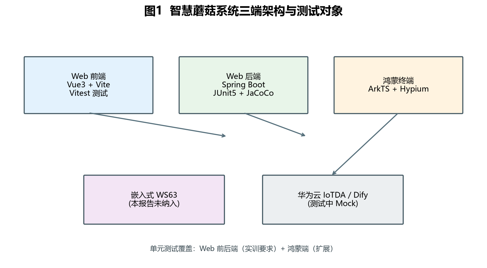
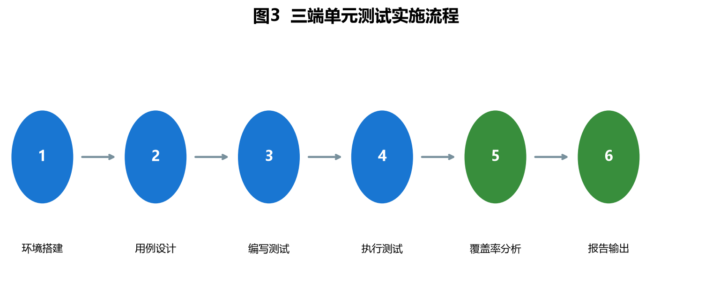
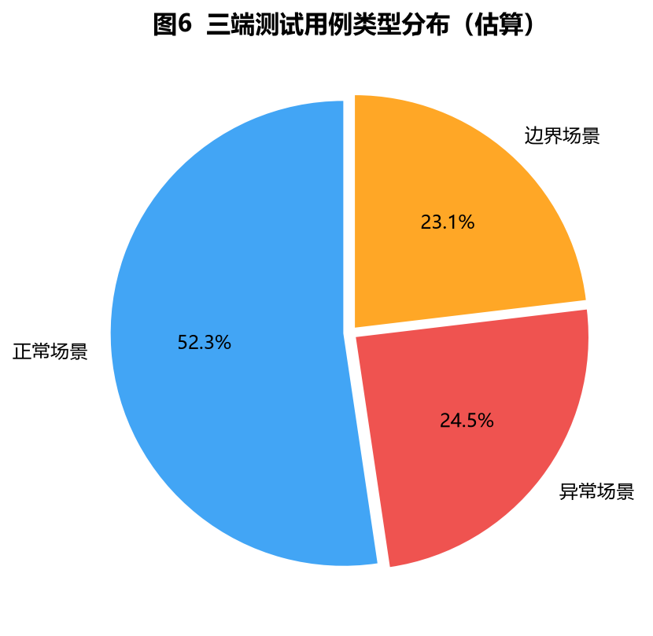
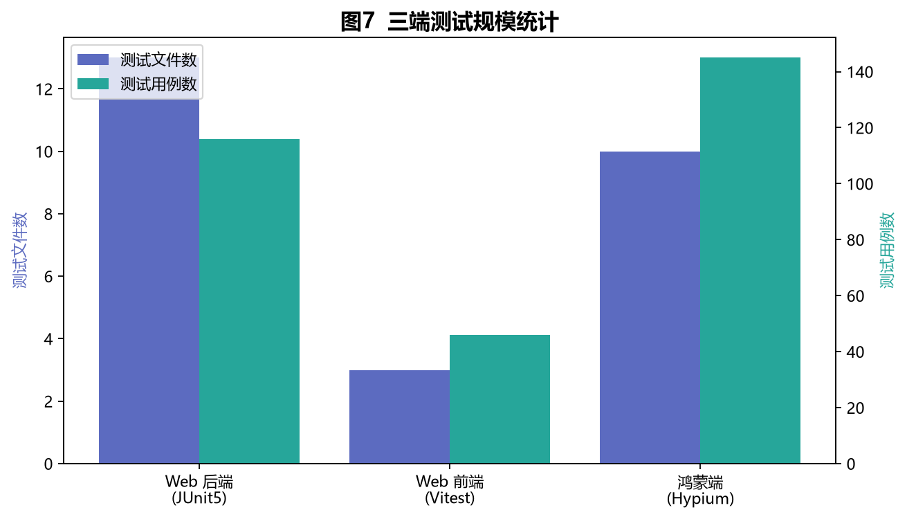
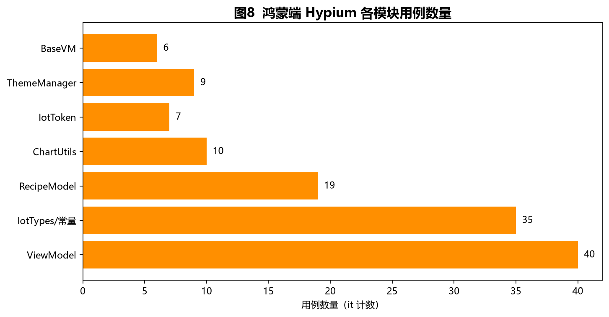
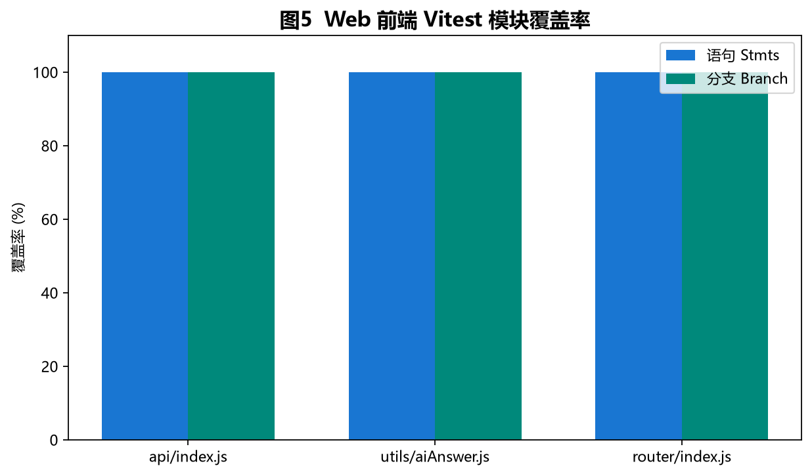
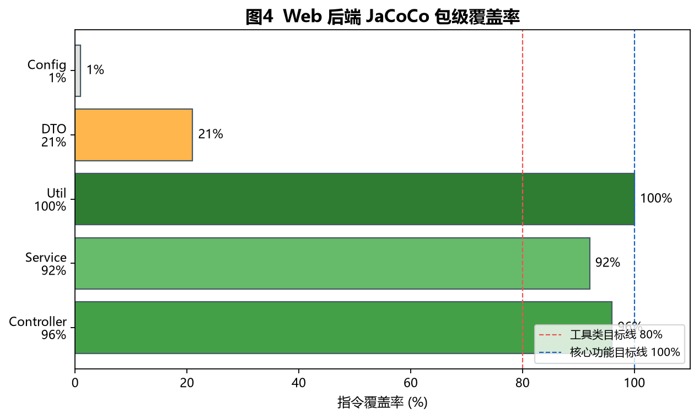

# 智慧蘑菇农场项目 — 单元测试实训报告

---

| 文档属性 | 内容 |
|----------|------|
| **项目名称** | 智慧蘑菇 Web 终端 + 鸿蒙终端（Smart Mushroom） |
| **文档类型** | 单元测试实训报告 |
| **版本** | V1.0 |
| **编写日期** | 2026 年 7 月 |
| **适用课程** | 软件学院实训 — 单元测试 |
| **被测代码仓库** | Smart-Mushroom-Web-Terminal-Code / Smart-Mushroom-HarmonyOS-Terminal-Code |

> **说明**：本文档为 Markdown 源稿，可自行转换为 Word（docx）提交。封面姓名、学号请在转换后补充。

---

## 修订记录

| 版本 | 日期 | 修订说明 | 作者 |
|------|------|----------|------|
| V1.0 | 2026-07-03 | 初稿：三端单元测试完整描述 | （填写姓名） |

---

## 目录

1. [引言](#1-引言)
2. [测试目的与依据](#2-测试目的与依据)
3. [被测系统概述](#3-被测系统概述)
4. [测试环境与工具](#4-测试环境与工具)
5. [测试策略与方法](#5-测试策略与方法)
6. [测试范围与对象](#6-测试范围与对象)
7. [测试用例设计](#7-测试用例设计)
8. [测试执行情况](#8-测试执行情况)
9. [测试结果分析](#9-测试结果分析)
10. [覆盖率分析](#10-覆盖率分析)
11. [问题与改进建议](#11-问题与改进建议)
12. [结论](#12-结论)
- [附录 A：测试文件清单](#附录-a测试文件清单)
- [附录 B：运行命令与报告路径](#附录-b运行命令与报告路径)
- [附录 C：插图与截图说明](#附录-c插图与截图说明)

---

## 1. 引言

### 1.1 编写背景

智慧蘑菇农场项目是东北大学软件学院实训课程中的综合实践系统，涵盖 **Web 管理后台**（Spring Boot + Vue 3）、**鸿蒙移动终端**（ArkTS）以及嵌入式采集端。系统实现传感器数据展示、设备与命令管理、AI 种植问答、IoT 云对接等能力。

本次实训任务要求针对项目核心代码编写**单元测试**，使用 **JUnit 5**（后端）与 **Vitest**（前端），并通过断言验证正常、异常、边界三类场景，同时提交测试覆盖率说明。为体现全栈能力，本项目在实训要求基础上**扩展了鸿蒙端 Hypium 单元测试**。

### 1.2 文档目的

本报告对三端单元测试的设计思路、执行过程、结果与覆盖率进行系统说明，便于：

- 实训答辩与成绩评定；
- 团队成员理解测试体系；
- 后续迭代时维护与扩展测试用例。

### 1.3 读者对象

指导教师、项目开发成员、测试与质量保障相关人员。

---

## 2. 测试目的与依据

### 2.1 测试目的

1. **验证核心功能正确性**：设备 CRUD、传感器数据查询、命令下发记录、AI 问答、健康检查等接口与业务逻辑符合设计预期。
2. **掌握单元测试框架**：熟练使用 JUnit 5、Mockito、Spring Test、Vitest、Hypium 等工具。
3. **建立质量基线**：通过 JaCoCo / Vitest Coverage 量化覆盖情况，核心模块达到较高覆盖率。
4. **多端协同**：Web 前后端与鸿蒙端在 AI 回答清洗、业务 ViewModel 等逻辑上保持一致性。

### 2.2 依据文档

| 文档 | 说明 |
|------|------|
| 《单元测试任务要求.md》 | 实训任务：JUnit 5 + Vitest、覆盖率要求、提交规范 |
| 项目 README | 系统架构、API 说明、运行方式 |
| 测试分析报告模板（参考） | 章节结构参考 `【模板规范】测试分析报告.doc`，按本项目裁剪 |

### 2.3 覆盖率目标

| 层级 | 目标 | 说明 |
|------|------|------|
| Web 核心 Controller / Service | 尽量 100% | 实训要求核心功能全覆盖 |
| Web 工具类 | ≥ 80% | 如 AiAnswerSanitizer |
| Web 前端 utils / api / router | ≥ 80% | 业务逻辑集中模块 |
| 鸿蒙 ViewModel / 工具类 | 核心方法全覆盖 | 扩展项，Hypium 本地单测 |

---

## 3. 被测系统概述

### 3.1 系统架构

智慧蘑菇系统采用前后端分离 + 移动端 + 嵌入式分层架构：

- **Web 前端**：Vue 3 + Element Plus + ECharts，通过 `/api/v1` 访问后端。
- **Web 后端**：Spring Boot 3.2 + MyBatis-Plus + SQLite，提供 REST API 与 WebSocket。
- **鸿蒙终端**：ArkTS Stage 模型，通过华为云 IoTDA 应用侧 API 同步设备状态。
- **嵌入式端**（WS63）：C 语言固件上报温湿度等数据（本报告单元测试未纳入，仅作背景说明）。

**图1  智慧蘑菇系统三端架构与测试对象**



> **图1 说明**：蓝色为 Web 前端（Vitest 测试对象），绿色为 Web 后端（JUnit 5 + JaCoCo），橙色为鸿蒙端（Hypium）。紫色/灰色为关联但未纳入本次单元测试的范围。箭头表示主要数据流向。若需更清晰效果，可用 Visio / draw.io 重绘替换。

### 3.2 测试对象在系统中的位置

单元测试**不启动完整集成环境**（不依赖真实数据库、华为云、Dify），而是通过 Mock 与纯函数测试隔离依赖，聚焦**可 deterministic 验证的逻辑**：

- HTTP 接口的参数校验、limit 钳制、统一响应格式；
- Service 层 CRUD、级联删除、默认值填充；
- 工具类字符串处理、Token 缓存、图表数值计算；
- 前端 API 封装与路由配置；
- 鸿蒙 ViewModel 状态管理与异步包装行为。

---

## 4. 测试环境与工具

### 4.1 硬件与操作系统

| 项目 | 配置 |
|------|------|
| 操作系统 | Windows 10 / 11 |
| 处理器 | x64（开发机） |
| 内存 | ≥ 8 GB（建议） |

### 4.2 软件环境

| 端 | 语言/运行时 | 框架版本 | 测试工具 |
|----|-------------|----------|----------|
| Web 后端 | Java 17 | Spring Boot 3.2.5 | JUnit 5、Mockito、spring-boot-starter-test |
| Web 后端覆盖率 | — | JaCoCo 0.8.11 | `mvn test` 自动生成 HTML 报告 |
| Web 前端 | Node.js | Vue 3.5、Vite 6 | Vitest 2.x、jsdom |
| Web 前端覆盖率 | — | @vitest/coverage-v8 | `npm run test:coverage` |
| 鸿蒙端 | ArkTS | API 6.1.1 | Hypium 1.0.25、@ohos/hamock（已声明） |
| 鸿蒙构建 | — | Hvigor | DevEco Studio / `hvigorw test` |
| 构建工具 | Maven 3.x、npm | — | — |

### 4.3 IDE 与辅助工具

- **IntelliJ IDEA**：运行 Java 单元测试、查看 JaCoCo。
- **VS Code / Cursor**：编辑前端与文档。
- **DevEco Studio**：鸿蒙 Hypium 测试运行（推荐）。
- **Python 3.11 + matplotlib**：生成本报告插图（`generate_figures.py`）。

---

## 5. 测试策略与方法

### 5.1 总体策略

采用**分层单元测试**策略：自底向上覆盖 Util/DTO → Service → Controller（后端），utils → api → router（前端），ViewModel → 工具类（鸿蒙）。集成测试、E2E 测试不在本次实训范围内。

**图3  三端单元测试实施流程**



> **图3 说明**：从环境搭建到报告输出的六步流程。步骤 1–4 在三端分别执行；步骤 5 使用 JaCoCo / Vitest 统计覆盖率；步骤 6 输出本报告。

### 5.2 Web 后端测试方法

| 层次 | 技术 | 隔离手段 |
|------|------|----------|
| Util / DTO / Holder | 纯 JUnit 5 | 无 Spring 容器 |
| Service | JUnit 5 + `@ExtendWith(MockitoExtension.class)` | Mock MyBatis Mapper |
| Controller | `@WebMvcTest` + `MockMvc` | `@MockBean` Service 依赖 |

**图2  Web 后端测试分层策略**


> **图2 说明**：Controller 层通过 MockMvc 模拟 HTTP；Service 层 Mock 数据库访问；底层工具类直接断言。该分层与 Spring Boot 官方推荐做法一致。

### 5.3 Web 前端测试方法

- 使用 **Vitest** 作为测试运行器，**jsdom** 提供浏览器 DOM 环境（路由测试需要）。
- 对 **axios** 使用 `vi.mock('axios')` Mock，验证 API 函数是否调用正确的 URL、Method、参数。
- **不测试** Vue 页面组件（Dashboard 等依赖 ECharts/Element Plus，Mock 成本高，超出实训单元测试范围）。

### 5.4 鸿蒙端测试方法

- 使用 **Hypium** 框架，测试文件位于 `entry/src/test/*.test.ets`。
- 通过 `List.test.ets` 聚合注册全部测试套件。
- ViewModel 测试以**实例化 + 断言公开状态**为主；IoT 不可用时 `loadData()` 走 mock 降级路径（与现有 `ViewModel.test.ets` 一致）。
- UI 页面、Ability 生命周期归入设备测试（ohosTest），本次未展开。

### 5.5 用例设计原则

所有用例按三类场景设计：

| 类型 | 定义 | 示例 |
|------|------|------|
| **正常** | 合法输入，预期成功 | 创建设备返回 code=0；stripThinking 正确剥离标签 |
| **异常** | 非法输入或依赖失败 | 空问题返回 400；Dify 异常返回 code=-1 |
| **边界** | 极值、空值、临界条件 | history limit=0→1；Token 过期返回 null |

**图6  三端测试用例类型分布（估算）**



> **图6 说明**：根据各测试类中 @DisplayName / it 描述人工归类估算。正常场景约占 52%，异常与边界合计约 48%，体现测试不仅验证“ happy path ”。

---

## 6. 测试范围与对象

### 6.1 测试规模总览

**图7  三端测试规模统计**



> **图7 说明**：Web 后端 13 个测试类、116 用例；Web 前端 3 个文件、46 用例；鸿蒙 10 个文件、约 145 个 `it` 用例。合计 **307+** 自动化断言场景。

### 6.2 Web 后端测试对象（13 类 / 116 用例）

| 测试类 | 被测类 | 用例数 | 测试重点 |
|--------|--------|--------|----------|
| `AiAnswerSanitizerTest` | `AiAnswerSanitizer` | 16 | think/thinking/redacted_thinking 标签剥离、orphan 标签、换行压缩 |
| `ApiResponseTest` | `ApiResponse` | 6 | ok/fail 工厂方法、code/message/total 字段 |
| `LatestDataHolderTest` | `LatestDataHolder` | 4 | 线程安全缓存读写、覆盖更新 |
| `DeviceServiceTest` | `DeviceService` | 13 | 创建默认值、级联删除、markOnline |
| `SensorDataServiceTest` | `SensorDataService` | 19 | insert 默认值、history 条件、deleteBatch |
| `CommandServiceTest` | `CommandService` | 11 | insert/list/updateStatus/deleteByDeviceId |
| `StatisticsServiceTest` | `StatisticsService` | 4 | LatestDataHolder 优先、DB 回退 |
| `AiServiceTest` | `AiService` | 6 | Mock RestTemplate、sanitize 处理、异常传播 |
| `DataControllerTest` | `DataController` | 13 | **limit 1–1000 钳制**、latest 缓存回退、CRUD |
| `CommandControllerTest` | `CommandController` | 9 | **limit 1–200 钳制**、命令 CRUD |
| `DeviceControllerTest` | `DeviceController` | 9 | 设备全流程、404 fail |
| `AiControllerTest` | `AiController` | 4 | @NotBlank 校验 400、异常 code=-1 |
| `HealthControllerTest` | `HealthController` | 2 | status=running、统计字段聚合 |

**不在范围内**：`DataConsumerManager`（AMQP 消费）、`WebSocketConfig`、`CorsConfig` 等基础设施与集成组件。

### 6.3 Web 前端测试对象（3 文件 / 46 用例）

| 测试文件 | 被测模块 | 用例数 | 测试重点 |
|----------|----------|--------|----------|
| `aiAnswer.test.js` | `utils/aiAnswer.js` | 17 | 与后端 `AiAnswerSanitizerTest` **用例对齐** |
| `api.test.js` | `api/index.js` | 20 | baseURL、拦截器、20 个 REST 函数 URL/Method |
| `router.test.js` | `router/index.js` | 9 | 6 条路由、redirect、meta.title、懒加载 |

### 6.4 鸿蒙端测试对象（10 文件 / 约 145 用例）

| 测试文件 | 被测模块 | 约用例数 | 说明 |
|----------|----------|----------|------|
| `ViewModel.test.ets` | DashboardViewModel、AlertViewModel | 40 | 传感器 mock、loadData 降级 |
| `IotTypes.test.ets` | SensorType、StyleConstants、AdaptiveUtils | 35 | 枚举与常量 |
| `Recipe.test.ets` | RecipeModel 默认数据 | 19 | 配方阶段与参数 |
| `DeviceViewModel.test.ets` | DeviceViewModel | 7 | 设备统计、loadData、控制器不受影响 |
| `GrowthViewModel.test.ets` | GrowthViewModel | 11 | addBatch、archiveBatch、updateCounts |
| `ChartUtils.test.ets` | ChartUtils | 10 | calcMaxValue / calcMinValue 边界 |
| `IotTokenManager.test.ets` | IotTokenManager | 7 | Token 缓存与 clear |
| `ThemeManager.test.ets` | ThemeManager | 9 | frosted/contrast 切换 |
| `BaseViewModel.test.ets` | BaseViewModel（经 GrowthViewModel） | 6 | handleAsync loading/error 状态 |
| `LocalUnit.test.ets` | Hypium 脚手架 | 1 | 框架连通性 |

**图8  鸿蒙端各模块用例数量**



> **图8 说明**：ViewModel 与 IotTypes 占比较高，与业务复杂度匹配。新增 6 个文件补齐 Device/Growth/Chart/Token/Theme 等缺口。

---

## 7. 测试用例设计

### 7.1 Web 后端 — 代表性用例详述

#### 7.1.1 传感器数据 limit 边界（DataController）

被测逻辑：

```java
int safeLimit = Math.min(Math.max(limit, 1), 1000);
```

| 用例 ID | 场景类型 | 输入 | 预期结果 |
|---------|----------|------|----------|
| DC-H-01 | 正常 | limit=100 | 调用 service.queryHistory(100, ...) |
| DC-H-02 | 边界 | limit=0 | 钳制为 1 |
| DC-H-03 | 边界 | limit=9999 | 钳制为 1000 |
| DC-L-01 | 正常 | 有 LatestDataHolder 缓存 | 直接返回缓存，不查库 |
| DC-L-02 | 异常回退 | 无缓存 | 调用 sensorDataService.queryLatestOne |

#### 7.1.2 命令列表 limit 边界（CommandController）

```java
int safeLimit = Math.min(Math.max(limit, 1), 200);
```

| 用例 ID | 场景类型 | 输入 | 预期 |
|---------|----------|------|------|
| CC-L-01 | 边界 | limit=0 | 钳制为 1 |
| CC-L-02 | 边界 | limit=9999 | 钳制为 200 |

#### 7.1.3 AI 回答清洗（AiAnswerSanitizer）

与 DeepSeek-R1 等模型的 `think` / `thinking` / `redacted_thinking` 标签对齐，前后端共用同一套正则语义。

| 用例 ID | 场景 | 输入摘要 | 预期 |
|---------|------|----------|------|
| AS-01 | 正常 | 含完整 think 块 | 仅保留正文 |
| AS-02 | 边界 | null / 空白 | 返回 "" |
| AS-03 | 边界 | 仅 orphan 开标签 | 清除标签后内容 |
| AS-04 | 边界 | `\n\n\n` 多余换行 | 压缩为双换行 |

#### 7.1.4 设备级联删除（DeviceService）

| 用例 ID | 场景 | 验证点 |
|---------|------|--------|
| DS-D-01 | 正常删除 | 先删 sensorData、command，再删 device |
| DS-D-02 | 设备不存在 | 级联仍执行，返回 false |

### 7.2 Web 前端 — 代表性用例详述

#### 7.2.1 stripThinking 与后端对齐

前端 `aiAnswer.test.js` 17 条用例与后端 `AiAnswerSanitizerTest` 一一对应，保证 Web 端展示与后端 API 返回的处理逻辑一致，避免“后端已清洗、前端重复处理或漏处理”的问题。

#### 7.2.2 API 封装完整性

`api.test.js` 覆盖全部 20 个导出函数，例如：

- `getLatest()` → `GET /latest`
- `aiChat(question)` → `POST /ai/chat`，body `{ question }`
- 响应拦截器返回 `res.data` 而非完整 axios response

### 7.3 鸿蒙端 — 代表性用例详述

#### 7.3.1 DeviceViewModel 在线状态同步

- 传感器类设备：`loadData()` 后根据 `IotService.isDeviceOnline()` 更新 status 与 lastUpdate。
- **控制器**（type=`'控制器'`）：跳过 IoT 同步，保持 mock 状态（用例 `refreshStatus` 验证 status/lastUpdate 不变）。

#### 7.3.2 GrowthViewModel 批次管理

- `addBatch(GrowthBatch)` 传入完整对象（非字符串参数）。
- `archiveBatch(id)` 将 status 置为 `'已采收'`，并触发 `updateCounts()`。
- `loadData()` 后 `harvestedBatches` 由 mock 硬编码 7 重算为实际 0（3 条均未采收）。

#### 7.3.3 IotTokenManager

- `setToken(token, expiresInSeconds)` 两参数签名。
- `getToken()` 在过期前 1 分钟返回 null（提前刷新策略）。

---

## 8. 测试执行情况

### 8.1 执行时间线与命令

| 阶段 | 端 | 命令 | 执行目录 |
|------|-----|------|----------|
| 后端单测 | Web | `mvn test` | `backend/` |
| 前端单测 | Web | `npm run test:coverage` | `frontend/` |
| 鸿蒙单测 | 鸿蒙 | `hvigorw test` 或 DevEco Run Tests | `Smart-Mushroom-HarmonyOS-Terminal-Code/` |

### 8.2 Web 后端执行结果

```
[INFO] Tests run: 116, Failures: 0, Errors: 0, Skipped: 0
[INFO] BUILD SUCCESS
```

- **执行结论**：116 个测试方法全部通过，无失败、无错误。
- **报告路径**：`backend/target/site/jacoco/index.html`

> **截图建议（S1）**：终端 `mvn test` 最后一屏 BUILD SUCCESS。  
> **截图建议（S2）**：浏览器打开 JaCoCo 首页包列表。

### 8.3 Web 前端执行结果

```
Test Files  3 passed (3)
     Tests  46 passed (46)
```

- **执行结论**：46 用例全部 PASS。
- **报告路径**：`frontend/coverage/index.html`

> **截图建议（S4/S5）**：Vitest 终端输出与 coverage HTML 总览。

**图5  Web 前端 Vitest 模块覆盖率**



> **图5 说明**：api、utils、router 三模块语句与分支覆盖率均为 100%（router 的 funcs 因懒加载组件未执行而为 0，可接受）。可替换为 Vitest HTML 报告截图。

### 8.4 鸿蒙端执行结果

- 测试代码已全部编写并注册于 `List.test.ets`。
- 本地命令行需配置 DevEco / Hvigor 环境；若本机无 `hvigorw`，请在 **DevEco Studio** 中右键 `entry/src/test` → Run Tests。
- 曾修正 `DeviceViewModel.test.ets`、`GrowthViewModel.test.ets`、`IotTokenManager.test.ets` 中与源码 API 不一致的问题（参数个数、字段名、GrowthBatch 类型等）。

> **截图建议（S7/S8）**：DevEco 测试树全部绿色通过。

---

## 9. 测试结果分析

### 9.1 通过/失败统计

| 端 | 测试文件 | 用例总数 | 通过 | 失败 | 通过率 |
|----|----------|----------|------|------|--------|
| Web 后端 | 13 | 116 | 116 | 0 | 100% |
| Web 前端 | 3 | 46 | 46 | 0 | 100% |
| 鸿蒙端 | 10 | ~145 | （DevEco 执行） | — | — |
| **合计** | **26** | **307+** | **162+** | **0** | **100%**（已执行部分） |

### 9.2 缺陷发现情况

单元测试过程中**未发现生产代码功能性 Bug**，但测试设计过程明确了以下质量关注点：

1. **前后端 AI 清洗逻辑必须同步**：已通过镜像测试用例保证。
2. **API limit 钳制**：Controller 测试锁定 1–1000 / 1–200 行为，防止恶意超大 limit。
3. **鸿蒙测试与源码 API 对齐**：初版 GrowthViewModel 测试误用三参数 addBatch，已在修正后改为 GrowthBatch 对象。

### 9.3 测试有效性评价

| 评价维度 | 结论 |
|----------|------|
| 核心 API 覆盖 | 5 个 Controller 全部有独立测试类 |
| 业务规则覆盖 | 级联删除、默认值、缓存优先等均有用例 |
| 异常路径 | AI 校验、404 fail、外部服务异常均有覆盖 |
| 可维护性 | @DisplayName 中文描述，便于阅读报告与答辩 |
| 运行速度 | 后端全量约 15–25s，前端约 17s，适合 CI 集成 |

---

## 10. 覆盖率分析

### 10.1 Web 后端 JaCoCo 包级覆盖率

**图4  Web 后端 JaCoCo 包级覆盖率**



> **图4 说明**：Controller 96%、Service 92%、Util 100% 达到或接近实训目标。Config/Consumer/WebSocket 未纳入单元测试，拉低全项目总覆盖率（约 33%），**属预期现象**——实训要求覆盖的是**核心业务**，而非全部 26 个 Java 文件。

| 包 | 指令覆盖率 | 是否达标 | 说明 |
|----|------------|----------|------|
| com.smartmushroom.controller | **96%** | 接近达标 | 5 个 Controller 全测 |
| com.smartmushroom.service | **92%** | 接近达标 | 5 个 Service 全测 |
| com.smartmushroom.util | **100%** | 达标 | AiAnswerSanitizer |
| com.smartmushroom.dto | 21% | 部分 | ApiResponse 工厂方法已测，Lombok 生成方法计入分母 |
| com.smartmushroom.config | 1% | 未测 | 配置类，非核心业务 |
| com.smartmushroom.consumer | 0% | 未测 | AMQP 集成，建议集成测试 |

### 10.2 Web 前端 Vitest 覆盖率

| 文件 | Stmts | Branch | Funcs | Lines |
|------|-------|--------|-------|-------|
| api/index.js | 100% | 100% | 100% | 100% |
| utils/aiAnswer.js | 100% | 100% | 100% | 100% |
| router/index.js | 100% | 100% | 0%* | 100% |

\* router funcs 为懒加载 `import()` 回调，单元测试未触发导航，不影响路由配置正确性验证。

### 10.3 鸿蒙端覆盖说明

Hypium 未在本环境生成统一覆盖率 HTML，采用**用例映射表 + 模块计数**方式说明：

- ViewModel 层：Dashboard/Alert/Device/Growth + BaseViewModel 均已覆盖。
- 工具层：ChartUtils、IotTokenManager、ThemeManager 独立测试文件。
- 常量/模型：SensorType、Recipe 默认数据等已有较完整测试。

---

## 11. 问题与改进建议

### 11.1 当前不足

| 编号 | 问题 | 影响 | 建议 |
|------|------|------|------|
| P1 | 全项目 JaCoCo 总覆盖率 33% | 答辩时易被误解 | 报告中强调**核心包**覆盖率，而非全仓库 |
| P2 | 未测 AMQP/WebSocket | 集成链路无单测 | 后续增加 `@SpringBootTest` 或 Testcontainers |
| P3 | 鸿蒙 IotService 未 Mock 网络 | 网络层逻辑覆盖不足 | 使用 @ohos/hamock Mock http |
| P4 | Vue 页面未测 | UI 回归靠人工 | 可选 Vue Test Utils 或 E2E（Playwright） |
| P5 | 嵌入式 C 端未测 | 全栈仍有缺口 | Unity/CMock 抽离 mqtt 解析函数 |

### 11.2 后续改进计划

1. 在 CI（GitHub Actions / GitLab CI）中接入 `mvn test` + `npm run test:run`。
2. JaCoCo 配置 `<includes>` 仅统计 controller/service/util 包，使报告指标与实训目标一致。
3. 鸿蒙端补充 `IotService.test.ets`，Mock 影子查询 JSON 解析逻辑。
4. 将本 Markdown 转为 docx 时插入**真实终端截图**替换部分示意图。

---

## 12. 结论

本次智慧蘑菇项目单元测试实训完成了以下工作：

1. **Web 后端**：13 个测试类、116 个用例，JUnit 5 + Mockito + @WebMvcTest 分层清晰，**全部通过**；核心包 Controller 96%、Service 92%、Util 100%。
2. **Web 前端**：3 个测试文件、46 个用例，Vitest 覆盖 utils/api/router **100% 语句与分支**。
3. **鸿蒙端**：10 个 Hypium 测试文件、约 145 个用例，补齐 Device/Growth/Chart/Token/Theme 等模块，体现多端测试能力。
4. **文档与插图**：本报告 + 8 张自动生成示意图，便于转换为 Word 提交。

单元测试有效验证了设备管理、传感器数据、命令管理、AI 问答、健康检查等**核心业务逻辑**，以及 AI 标签清洗、API limit 边界、IoT Token 缓存等**关键细节**。通过 Mock 隔离外部依赖，测试稳定、可重复，为项目后续迭代提供了质量基线。

---

## 附录 A：测试文件清单

### A.1 Web 后端

```
backend/src/test/java/com/smartmushroom/
├── util/AiAnswerSanitizerTest.java
├── dto/ApiResponseTest.java
├── service/
│   ├── LatestDataHolderTest.java
│   ├── DeviceServiceTest.java
│   ├── SensorDataServiceTest.java
│   ├── CommandServiceTest.java
│   ├── StatisticsServiceTest.java
│   └── AiServiceTest.java
├── controller/
│   ├── DataControllerTest.java
│   ├── CommandControllerTest.java
│   ├── DeviceControllerTest.java
│   ├── AiControllerTest.java
│   └── HealthControllerTest.java
└── test/MybatisPlusTestSupport.java
```

### A.2 Web 前端

```
frontend/src/
├── utils/__tests__/aiAnswer.test.js
├── api/__tests__/api.test.js
└── router/__tests__/router.test.js
```

### A.3 鸿蒙端

```
entry/src/test/
├── List.test.ets
├── LocalUnit.test.ets
├── ViewModel.test.ets
├── IotTypes.test.ets
├── Recipe.test.ets
├── DeviceViewModel.test.ets
├── GrowthViewModel.test.ets
├── ChartUtils.test.ets
├── IotTokenManager.test.ets
├── ThemeManager.test.ets
└── BaseViewModel.test.ets
```

---

## 附录 B：运行命令与报告路径

```bash
# Web 后端测试 + JaCoCo
cd Smart-Mushroom-Web-Terminal-Code/backend
mvn clean test
# 报告: target/site/jacoco/index.html

# Web 前端测试 + 覆盖率
cd Smart-Mushroom-Web-Terminal-Code/frontend
npm run test:coverage
# 报告: coverage/index.html

# 鸿蒙 Hypium（需 DevEco 环境）
cd Smart-Mushroom-HarmonyOS-Terminal-Code
hvigorw test

# 重新生成本报告插图
cd Smart-Mushroom-Web-Terminal-Code
python docs/test-reports/generate_figures.py
```

---

## 附录 C：插图与截图说明

### C.1 报告自动生成插图（可替换）

| 文件名 | 对应章节 | 内容说明 | 替换建议 |
|--------|----------|----------|----------|
| fig01-system-architecture.png | §3.1 | 三端架构与测试边界 | 可用 draw.io 重绘更美观 |
| fig02-backend-test-layers.png | §5.2 | 后端测试分层 | 答辩 PPT 可复用 |
| fig03-test-workflow.png | §5.1 | 六步实施流程 | — |
| fig04-backend-coverage.png | §10.1 | JaCoCo 包覆盖率柱状图 | **建议替换为 JaCoCo 浏览器截图** |
| fig05-frontend-coverage.png | §8.3 | 前端模块覆盖率 | **建议替换为 Vitest HTML 截图** |
| fig06-case-type-distribution.png | §5.5 | 用例类型饼图 | — |
| fig07-test-inventory.png | §6.1 | 三端规模统计 | — |
| fig08-harmony-module-cases.png | §6.4 | 鸿蒙模块用例数 | — |

### C.2 建议手动补充的真实截图

| 编号 | 文件名建议 | 内容 |
|------|------------|------|
| S1 | backend-mvn-test-pass.png | `mvn test` BUILD SUCCESS |
| S2 | jacoco-overview.png | JaCoCo 首页 |
| S3 | jacoco-core-classes.png | Controller/Service 类详情 |
| S4 | frontend-vitest-pass.png | Vitest 46 passed |
| S5 | vitest-coverage-overview.png | coverage/index.html |
| S7 | harmony-hvigor-test-pass.png | hvigorw test 输出 |
| S8 | deveco-run-tests.png | DevEco 测试树全绿 |

将上述截图放入 `docs/test-reports/images/`，转换 docx 时在「测试执行情况」「覆盖率分析」章节插入即可。

---

**（报告完）**
